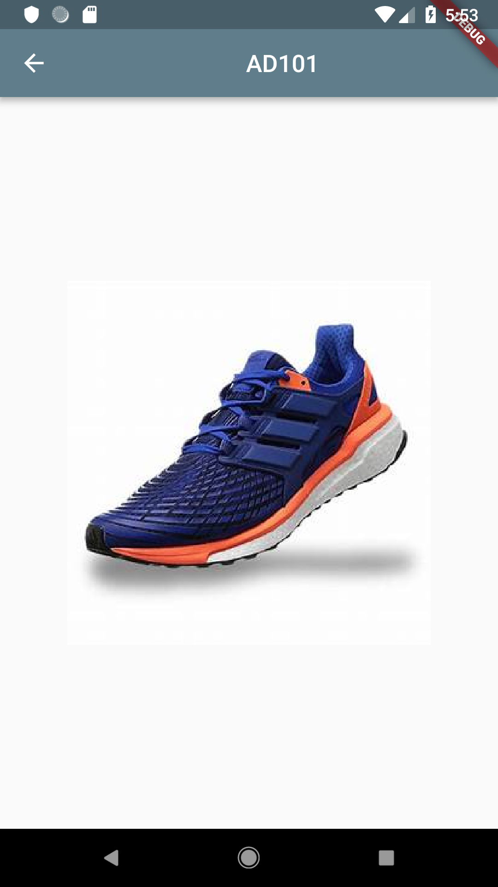

# Adidas app challenge

This is my attempt for the Adidas challenge, i'm starting to grasp the whole Flutter concept so its very basic but yet
really powerful.

The app consists of three screens as desbribed below:

# The entry

Displays the Adidas logo and is based on a GestureDetector widget so the user can click anywhere in the page to navigate
to the next page

# The Products

Displays the products available in the store, I did very simple so its based on images in the assets directory.
Every Card widget has a GestureDetector wich on tap navigates do the product view

# Product view

Displays the product image when the Card widget on products list get tapped.

# Wrap up

I'm new to the Mobile development but I'm enjoying the Flutter experience so far and planning to continue e integrate
with my studies on Reactive programming for Akka to create amazing products.